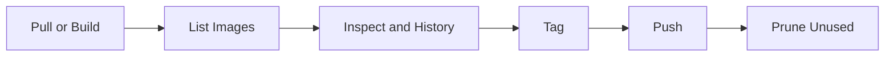

# 01 Image Commands

## What is it
Image commands are the Docker commands we use to download, build, inspect, tag, and publish images.

## Why do we need it
If we cannot manage images well, we cannot build repeatable containers.

## Real life analogy
An image is like a packaged meal kit. Image commands are the actions to get the kit, label it, inspect it, and send it.

## How does it work
- We pull or build an image.
- We list and inspect what we have.
- We tag images for sharing.
- We push to a registry.
- We remove unused images to save disk space.



## Code or Command Example
### WRONG way first
```bash
# WRONG: no version tag, not reproducible
docker pull nginx
```

### CORRECT way
```bash
# CORRECT: use a specific version tag
docker pull nginx:1.27.0
```

Expected terminal output:
```text
1.27.0: Pulling from library/nginx
Digest: sha256:...
Status: Downloaded newer image for nginx:1.27.0
```

## Command Reference

### docker pull
What the command does in one line: Download an image from a registry.

Full syntax:
```bash
docker pull [OPTIONS] NAME[:TAG|@DIGEST]
```

Common flags:
- --platform: Pull for a specific platform, for example linux/amd64.
- --quiet: Show only image ID on success.

Real world example:
```bash
# Pull a fixed Node.js image for stable builds
docker pull node:18.20.4-alpine3.20
```

Expected output:
```text
18.20.4-alpine3.20: Pulling from library/node
Status: Downloaded newer image for node:18.20.4-alpine3.20
```

### docker build -t name:tag path
What the command does in one line: Build an image from a Dockerfile.

Full syntax:
```bash
docker build [OPTIONS] PATH | URL | -
```

Common flags:
- -t, --tag: Name and tag the image.
- -f, --file: Use a custom Dockerfile path.
- --build-arg: Pass build-time variables.
- --no-cache: Build without using cache.

Real world example:
```bash
# Build image from current directory and tag it
docker build --tag myapp:1.0.0 .
```

Expected output:
```text
[+] Building ...
Successfully tagged myapp:1.0.0
```

### docker images
What the command does in one line: List local images.

Full syntax:
```bash
docker images [OPTIONS] [REPOSITORY[:TAG]]
```

Common flags:
- -a, --all: Show all images including intermediate layers.
- --digests: Show image digests.
- --filter: Filter results.

Real world example:
```bash
# Show only node images
docker images --filter reference='node*'
```

Expected output:
```text
REPOSITORY   TAG                  IMAGE ID       CREATED         SIZE
node         18.20.4-alpine3.20   abcdef123456   2 weeks ago     130MB
```

### docker image ls
What the command does in one line: Modern equivalent of docker images.

Full syntax:
```bash
docker image ls [OPTIONS] [REPOSITORY[:TAG]]
```

Common flags:
- -a, --all: Show all images.
- --format: Custom output formatting.

Real world example:
```bash
# Table output with custom columns
docker image ls --format "table {{.Repository}}\t{{.Tag}}\t{{.Size}}"
```

Expected output:
```text
REPOSITORY   TAG                  SIZE
node         18.20.4-alpine3.20   130MB
```

### docker rmi imagename
What the command does in one line: Remove one or more images.

Full syntax:
```bash
docker rmi [OPTIONS] IMAGE [IMAGE...]
```

Common flags:
- -f, --force: Force remove.
- --no-prune: Keep untagged parent images.

Real world example:
```bash
# Remove an old image tag
docker rmi myapp:0.9.0
```

Expected output:
```text
Untagged: myapp:0.9.0
Deleted: sha256:...
```

### docker image prune
What the command does in one line: Remove dangling or unused images.

Full syntax:
```bash
docker image prune [OPTIONS]
```

Common flags:
- -a, --all: Remove all unused images, not only dangling.
- --filter: Filter prune target.
- -f, --force: Do not ask confirmation.

Real world example:
```bash
# Remove dangling images without prompt
docker image prune --force
```

Expected output:
```text
Deleted Images:
untagged: <none>:<none>
Total reclaimed space: 340MB
```

### docker tag
What the command does in one line: Create a new tag pointing to an existing image.

Full syntax:
```bash
docker tag SOURCE_IMAGE[:TAG] TARGET_IMAGE[:TAG]
```

Common flags:
- No major flags, command takes source and target image references.

Real world example:
```bash
# Tag local image for Docker Hub push
docker tag myapp:1.0.0 mydockeruser/myapp:1.0.0
```

Expected output:
```text
# Usually no output on success
```

### docker push
What the command does in one line: Upload an image tag to a registry.

Full syntax:
```bash
docker push [OPTIONS] NAME[:TAG]
```

Common flags:
- --all-tags: Push all tags of an image name.
- --quiet: Suppress verbose output.

Real world example:
```bash
# Push versioned image to Docker Hub
docker push mydockeruser/myapp:1.0.0
```

Expected output:
```text
The push refers to repository [docker.io/mydockeruser/myapp]
1.0.0: digest: sha256:... size: 1570
```

### docker image inspect
What the command does in one line: Show detailed JSON metadata for an image.

Full syntax:
```bash
docker image inspect [OPTIONS] IMAGE [IMAGE...]
```

Common flags:
- -f, --format: Print specific fields.

Real world example:
```bash
# Print operating system and architecture
docker image inspect node:18.20.4-alpine3.20 --format '{{.Os}}/{{.Architecture}}'
```

Expected output:
```text
linux/amd64
```

### docker history imagename
What the command does in one line: Show image layers and created commands.

Full syntax:
```bash
docker history [OPTIONS] IMAGE
```

Common flags:
- --no-trunc: Show full command text.
- --human: Human-friendly sizes.

Real world example:
```bash
# See layer history for debugging image size
docker history myapp:1.0.0 --no-trunc
```

Expected output:
```text
IMAGE          CREATED BY                                      SIZE
abcdef123456   /bin/sh -c npm ci --omit=dev                   35MB
```

## Common Mistakes
- Pulling or building without version tags.
- Deleting images before checking if containers still use them.
- Pushing image tags that were never tested locally.

## Best Practices
- Use explicit tags like node:18.20.4-alpine3.20.
- Inspect image metadata before production release.
- Keep cleanup commands in local maintenance routine.

## When to use it
Use these commands whenever you build, share, or troubleshoot Docker images.

## Related concepts
- [Images](../02-core-concepts/01-images.md)
- [Docker Registry](../02-core-concepts/06-docker-registry.md)

## Quick Revision
- Image commands control image lifecycle from pull to push.
- Tags make builds reproducible.
- Inspect and history help debug size and metadata.
- Prune safely after checking usage.
- Good image hygiene saves disk and avoids release errors.

## Interview Questions
1. What is the difference between docker images and docker image ls?
   - They are equivalent list commands; docker image ls is part of the newer command grouping.
2. Why should we avoid pulling images without a tag?
   - Untagged pulls default to latest, which can change and break reproducibility.
3. When do we use docker history?
   - We use it to find which layers make an image large.
4. What does docker tag do?
   - It creates another name and tag for the same image ID.
5. When is docker image prune risky?
   - It is risky if you run it blindly and remove images you still need.
