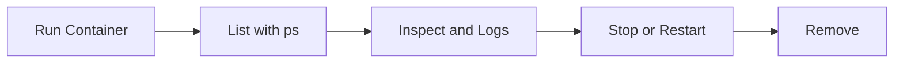

# 02 Container Commands

## What is it
Container commands are the commands we use to create, run, inspect, and manage containers.

## Why do we need it
Containers are the running part of Docker. If we cannot manage container lifecycle, the app cannot run reliably.

## Real life analogy
If image is a recipe, a container is the kitchen currently cooking that recipe.

## How does it work
- Create and run container from an image.
- Check running and stopped containers.
- Stop, restart, or remove containers.
- Inspect logs and live resource usage.



## Code or Command Example
### WRONG way first
```bash
# WRONG: no name and no version tag
docker run -d nginx
```

### CORRECT way
```bash
# CORRECT: explicit name, tag, and published port
docker run --detach --name myapp-web --publish 8080:80 nginx:1.27.0
```

Expected terminal output:
```text
f1e2d3c4b5a6...
```

## Command Reference

### docker run
What the command does in one line: Create and start a new container.

Full syntax:
```bash
docker run [OPTIONS] IMAGE[:TAG] [COMMAND] [ARG...]
```

Common flags:
- -d, --detach: Run in background.
- -p, --publish: Map host port to container port.
- -v, --volume: Mount volume or bind mount.
- -e, --env: Set environment variable.
- --name: Give container a readable name.
- --rm: Auto-remove container on exit.
- -it, --interactive --tty: Open interactive terminal session.

Real world example:
```bash
# Run user service in background with env and volume
docker run --detach --name user-service --publish 3000:3000 --env NODE_ENV=production --volume user-data:/app/data node:18.20.4-alpine3.20
```

Expected output:
```text
a1b2c3d4e5f6...
```

### docker ps and docker ps -a
What the command does in one line: List running containers or all containers.

Full syntax:
```bash
docker ps [OPTIONS]
docker ps --all [OPTIONS]
```

Common flags:
- -a, --all: Include stopped containers.
- --filter: Filter by name, status, image, and more.
- --format: Custom output format.

Real world example:
```bash
# Show all containers for a specific service
docker ps --all --filter name=user-service
```

Expected output:
```text
CONTAINER ID   NAMES          STATUS
abc123...      user-service   Up 2 minutes
```

### docker stop and docker kill
What the command does in one line: Stop gracefully or stop immediately.

Full syntax:
```bash
docker stop [OPTIONS] CONTAINER [CONTAINER...]
docker kill [OPTIONS] CONTAINER [CONTAINER...]
```

Common flags:
- docker stop --time: Seconds to wait before force kill.
- docker kill --signal: Signal to send.

Real world example:
```bash
# Graceful stop
docker stop --time 15 user-service

# Immediate stop
docker kill user-service
```

Expected output:
```text
user-service
```

### docker start and docker restart
What the command does in one line: Start stopped container or restart running one.

Full syntax:
```bash
docker start [OPTIONS] CONTAINER [CONTAINER...]
docker restart [OPTIONS] CONTAINER [CONTAINER...]
```

Common flags:
- -a, --attach: Attach stdout and stderr.
- -t, --time: Restart timeout in seconds.

Real world example:
```bash
# Restart the service after config change
docker restart --time 10 user-service
```

Expected output:
```text
user-service
```

### docker rm
What the command does in one line: Remove one or more containers.

Full syntax:
```bash
docker rm [OPTIONS] CONTAINER [CONTAINER...]
```

Common flags:
- -f, --force: Stop running container then remove.
- -v, --volumes: Remove anonymous volumes.

Real world example:
```bash
# Remove stopped container
docker rm user-service
```

Expected output:
```text
user-service
```

### docker exec -it container bash
What the command does in one line: Run command inside a running container.

Full syntax:
```bash
docker exec [OPTIONS] CONTAINER COMMAND [ARG...]
```

Common flags:
- -i, --interactive: Keep STDIN open.
- -t, --tty: Allocate pseudo terminal.
- -u, --user: Run as specific user.

Real world example:
```bash
# Open shell in running container
docker exec --interactive --tty user-service sh
```

Expected output:
```text
/app #
```

### docker logs container
What the command does in one line: Show container logs.

Full syntax:
```bash
docker logs [OPTIONS] CONTAINER
```

Common flags:
- -f, --follow: Stream logs in real time.
- --tail: Show only last N lines.
- --since: Show logs since timestamp.

Real world example:
```bash
# Follow last 50 lines
docker logs --follow --tail 50 user-service
```

Expected output:
```text
Server listening on port 3000
```

### docker inspect container
What the command does in one line: Show detailed container metadata.

Full syntax:
```bash
docker inspect [OPTIONS] NAME|ID [NAME|ID...]
```

Common flags:
- -f, --format: Print selected values.
- -s, --size: Add total file sizes.

Real world example:
```bash
# Print container status only
docker inspect user-service --format '{{.State.Status}}'
```

Expected output:
```text
running
```

### docker cp
What the command does in one line: Copy files between host and container.

Full syntax:
```bash
docker cp [OPTIONS] CONTAINER:SRC_PATH DEST_PATH
docker cp [OPTIONS] SRC_PATH CONTAINER:DEST_PATH
```

Common flags:
- -a, --archive: Preserve ownership.
- -L, --follow-link: Always follow symlinks.

Real world example:
```bash
# Copy logs from container to host
docker cp user-service:/app/logs ./logs
```

Expected output:
```text
# No output on success
```

### docker stats
What the command does in one line: Show live CPU, memory, network, and I/O usage.

Full syntax:
```bash
docker stats [OPTIONS] [CONTAINER...]
```

Common flags:
- --no-stream: Show one snapshot and exit.
- --format: Custom output formatting.

Real world example:
```bash
# Get one-time resource snapshot
docker stats --no-stream user-service
```

Expected output:
```text
CONTAINER      CPU %   MEM USAGE / LIMIT
user-service   0.48%   52MiB / 1GiB
```

## Common Mistakes
- Confusing stop and kill behavior.
- Using random container names, then losing track.
- Debugging without checking logs and inspect output.

## Best Practices
- Always set --name and explicit image tags.
- Use --rm for temporary helper containers.
- Use docker stats and logs during debugging.

## When to use it
Use these commands during daily development, debugging, testing, and local operations.

## Related concepts
- [Containers](../02-core-concepts/02-containers.md)
- [Container Communication](../07-networking/05-container-communication.md)

## Quick Revision
- Containers are running instances of images.
- docker run is the main create and start command.
- Logs, inspect, and stats are key debugging tools.
- stop is graceful, kill is immediate.
- Use clear names and tags for reliability.

## Interview Questions
1. What is the difference between docker stop and docker kill?
   - stop tries graceful shutdown first, kill stops immediately.
2. Why use --name in docker run?
   - It makes management and scripting easier than random IDs.
3. When do we use docker exec?
   - We use it to run commands or open a shell inside a running container.
4. What does --rm do?
   - It removes the container automatically when it exits.
5. Why is docker logs important?
   - It is the first place to find runtime errors.
