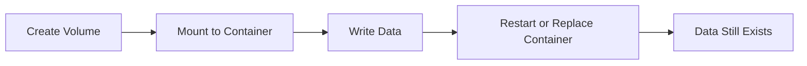

# 03 Volume Commands

## What is it
Volume commands manage persistent data storage used by containers.

## Why do we need it
Without volumes, important data can be lost when containers are removed.

## Real life analogy
A volume is like a labeled storage locker. Containers can come and go, but the locker stays.

## How does it work
- Create a named volume.
- Mount it into a container path.
- Inspect and list volumes.
- Remove unused volumes safely.



## Code or Command Example
### WRONG way first
```bash
# WRONG: store database data only inside container writable layer
docker run --name postgres-db --detach postgres:16.4
```

### CORRECT way
```bash
# CORRECT: use a named volume for persistent database data
docker volume create postgres-db-data
docker run --name postgres-db --detach --volume postgres-db-data:/var/lib/postgresql/data postgres:16.4
```

Expected terminal output:
```text
postgres-db-data
f2e3d4c5b6a7...
```

## Command Reference

### docker volume create
What the command does in one line: Create a new named volume.

Full syntax:
```bash
docker volume create [OPTIONS] [VOLUME]
```

Common flags:
- --driver: Select volume driver.
- --label: Add metadata label.
- --opt: Driver-specific options.

Real world example:
```bash
# Create volume for MySQL data
docker volume create mysql-data
```

Expected output:
```text
mysql-data
```

### docker volume ls
What the command does in one line: List existing Docker volumes.

Full syntax:
```bash
docker volume ls [OPTIONS]
```

Common flags:
- --filter: Filter by name, label, driver.
- --format: Custom output columns.

Real world example:
```bash
# Show only volumes with mysql in name
docker volume ls --filter name=mysql
```

Expected output:
```text
DRIVER    VOLUME NAME
local     mysql-data
```

### docker volume inspect
What the command does in one line: Show detailed volume metadata.

Full syntax:
```bash
docker volume inspect [OPTIONS] VOLUME [VOLUME...]
```

Common flags:
- -f, --format: Print selected fields.

Real world example:
```bash
# Inspect mount path for backup scripts
docker volume inspect mysql-data
```

Expected output:
```text
[
  {
    "Name": "mysql-data",
    "Driver": "local",
    "Mountpoint": "/var/lib/docker/volumes/mysql-data/_data"
  }
]
```

### docker volume rm
What the command does in one line: Remove one or more unused volumes.

Full syntax:
```bash
docker volume rm [OPTIONS] VOLUME [VOLUME...]
```

Common flags:
- -f, --force: Force removal.

Real world example:
```bash
# Remove no-longer-needed volume
docker volume rm old-cache
```

Expected output:
```text
old-cache
```

### docker volume prune
What the command does in one line: Remove all unused local volumes.

Full syntax:
```bash
docker volume prune [OPTIONS]
```

Common flags:
- -f, --force: No confirmation prompt.
- --filter: Prune with filter rules.

Real world example:
```bash
# Clean unused volumes in local dev
docker volume prune --force
```

Expected output:
```text
Deleted Volumes:
...
Total reclaimed space: 1.2GB
```

### Mounting volume with docker run -v
What the command does in one line: Attach a volume or bind mount when starting container.

Full syntax:
```bash
docker run [OPTIONS] --volume SOURCE:TARGET[:MODE] IMAGE[:TAG]
```

Common flags:
- SOURCE: Named volume name or host path.
- TARGET: Container path.
- MODE: Optional read-only ro mode.

Real world example:
```bash
# Mount named volume into PostgreSQL data directory
docker run --name postgres-db --detach --volume postgres-db-data:/var/lib/postgresql/data postgres:16.4
```

Expected output:
```text
a9b8c7d6e5f4...
```

## Common Mistakes
- Using container writable layer for database data.
- Deleting volumes without checking what uses them.
- Mixing bind mounts and named volumes without clear intent.

## Best Practices
- Use named volumes for databases and uploads.
- Inspect volume paths before backup and restore tasks.
- Prune only after checking active containers.

## When to use it
Use volume commands whenever data must survive container recreation.

## Related concepts
- [Volumes](../02-core-concepts/04-volumes.md)
- [Data Persistence Patterns](../08-storage/05-data-persistence-patterns.md)

## Quick Revision
- Volumes keep state outside container lifecycle.
- Create, mount, inspect, and prune are the key operations.
- Named volumes are best for databases.
- Always verify usage before delete.
- Persistent storage is critical for production reliability.

## Interview Questions
1. Why do we use volumes with databases?
   - To keep data after container removal or upgrade.
2. What is the difference between docker volume rm and prune?
   - rm removes specific volumes, prune removes all unused volumes.
3. How do you inspect where a volume is stored?
   - Use docker volume inspect and read Mountpoint.
4. When should you use read-only mount mode?
   - When container should read data but not modify it.
5. What happens if you do not use a volume?
   - Data can be lost when the container is removed.
