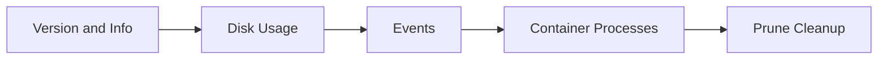

# 05 System Commands

## What is it
System commands show Docker engine details, disk usage, and runtime events.

## Why do we need it
These commands are essential for environment checks, cleanup, and debugging host-level Docker issues.

## Real life analogy
System commands are like a control room dashboard that shows health, usage, and activity.

## How does it work
- Check Docker client and engine versions.
- Inspect system details.
- Measure disk usage.
- Watch real-time events.
- Clean unused resources safely.



## Code or Command Example
### WRONG way first
```bash
# WRONG: prune everything before checking what is in use
docker system prune --all --volumes --force
```

### CORRECT way
```bash
# CORRECT: inspect first
docker system df --verbose

# Then prune with clear intent
docker system prune --force
```

Expected terminal output:
```text
TYPE            TOTAL   ACTIVE   SIZE      RECLAIMABLE
Images          12      5        4.2GB     2.8GB (66%)
Containers      7       3        120MB     95MB (79%)
```

## Command Reference

### docker info
What the command does in one line: Display Docker daemon and host information.

Full syntax:
```bash
docker info [OPTIONS]
```

Common flags:
- --format: Format output with templates.

Real world example:
```bash
# Print server version only
docker info --format '{{.ServerVersion}}'
```

Expected output:
```text
27.1.1
```

### docker version
What the command does in one line: Show client and server API versions.

Full syntax:
```bash
docker version [OPTIONS]
```

Common flags:
- --format: Custom format output.

Real world example:
```bash
# Check both client and server versions
docker version
```

Expected output:
```text
Client: Docker Engine - Community
 Version:           27.1.1
Server: Docker Engine - Community
 Version:           27.1.1
```

### docker system df
What the command does in one line: Show Docker disk usage.

Full syntax:
```bash
docker system df [OPTIONS]
```

Common flags:
- -v, --verbose: Detailed usage by object.

Real world example:
```bash
# View detailed disk usage before cleanup
docker system df --verbose
```

Expected output:
```text
Images space usage:
REPOSITORY   TAG       IMAGE ID       CREATED        SIZE
...
```

### docker system prune
What the command does in one line: Remove unused data (stopped containers, unused networks, dangling images, and build cache).

Full syntax:
```bash
docker system prune [OPTIONS]
```

Common flags:
- -a, --all: Remove all unused images, not only dangling.
- --volumes: Also remove anonymous volumes.
- -f, --force: Do not prompt confirmation.

Real world example:
```bash
# Standard cleanup without touching all image tags
docker system prune --force
```

Expected output:
```text
Deleted Containers:
...
Deleted Networks:
...
Total reclaimed space: 1.8GB
```

### docker events
What the command does in one line: Stream Docker daemon events in real time.

Full syntax:
```bash
docker events [OPTIONS]
```

Common flags:
- --since: Show events since a timestamp.
- --until: Stop at a timestamp.
- --filter: Filter event stream.

Real world example:
```bash
# Watch container events only
docker events --filter type=container
```

Expected output:
```text
2026-04-23T10:15:14.000000000Z container start user-service
```

### docker top
What the command does in one line: Show running processes inside a container.

Full syntax:
```bash
docker top CONTAINER [ps OPTIONS]
```

Common flags:
- ps OPTIONS: Optional process listing flags, for example aux.

Real world example:
```bash
# See container process list
docker top user-service
```

Expected output:
```text
PID     USER     TIME     COMMAND
12345   root     0:00     node server.js
```

## Common Mistakes
- Running prune commands without checking impact.
- Ignoring version mismatch between client and server.
- Debugging container issues without events or top.

## Best Practices
- Run docker info and docker version after setup changes.
- Use docker system df regularly to avoid disk surprises.
- Use targeted cleanup before aggressive prune.

## When to use it
Use system commands for diagnostics, housekeeping, and environment validation.

## Related concepts
- [Installation and Setup](../01-introduction/05-installation-and-setup.md)
- [Troubleshooting Guide](../11-interview-prep/03-troubleshooting-guide.md)

## Quick Revision
- System commands give host-level Docker visibility.
- Always inspect usage before cleanup.
- Events help track runtime behavior.
- top shows processes inside container.
- Good housekeeping prevents disk and stability problems.

## Interview Questions
1. Why is docker system df important?
   - It shows where Docker disk space is being used.
2. What is the risk of docker system prune --all --volumes?
   - It may remove data and images you still need.
3. When do we use docker events?
   - To monitor real-time lifecycle events for debugging.
4. What does docker top show?
   - The running process list inside a container.
5. Why compare docker info and docker version outputs?
   - To verify daemon health and client-server compatibility.
