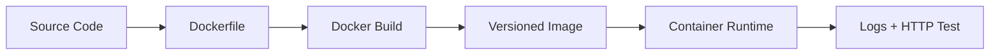

# 01 Node.js App

You just containerized your first app, that is huge. In this chapter, we build a realistic setup from zero.

## What is it
We are building a Dockerized Express API for local development and production deployment.

## Why do we need it
Node projects vary across machines because of Node version and local dependencies.

Without Docker, machine differences break onboarding and release speed. With Docker, we package app code, runtime, dependencies, and startup command in one repeatable unit.

## Real life analogy
Think of a restaurant kitchen chain. Every branch follows the same recipe card, ingredient list, and oven settings. That is what a Dockerfile plus Compose gives us.

## How does it work
- Write app code and dependency file.
- Create a Dockerfile with explicit base image tag.
- Add .dockerignore to avoid sending extra files.
- Build image and run container.
- Add Compose when multiple services are needed.
- Verify by checking logs, health, and API response.



## Code or Command Example
### WRONG way first
```bash
# WRONG: using latest and missing clear container name
docker build -t myapp:latest .
docker run -p 3000:3000 myapp:latest
```

### CORRECT way
```bash
# Build with a specific tag for reproducible results
docker build --tag myapp:1.0.0 .

# Run with a clear name and explicit restart behavior
docker run --name myapp-api --publish 3000:3000 --detach --restart unless-stopped myapp:1.0.0

# Confirm container is healthy and running
docker ps --filter name=myapp-api
```

Expected terminal output:
```text
[+] Building 18.2s (12/12) FINISHED
Successfully tagged myapp:1.0.0
CONTAINER ID   NAMES      IMAGE        STATUS
f1e2d3c4b5a6   myapp-api  myapp:1.0.0  Up 6 seconds
```

### Dockerfile
```dockerfile
# Stage 1: dependencies and build tools
FROM node:18.20.4-alpine3.20 AS build

# Create app directory inside image
WORKDIR /app

# Copy only package files first for better cache reuse
COPY package*.json ./

# Install full dependencies for build and test
RUN npm ci

# Copy source code
COPY . .

# Build step if needed (for TypeScript or bundling)
RUN npm run build

# Stage 2: production runtime image
FROM node:18.20.4-alpine3.20

# Set runtime environment variable
ENV NODE_ENV=production

# Create non-root user and group
RUN addgroup -S appgroup && adduser -S appuser -G appgroup

# Set working folder
WORKDIR /app

# Copy package manifests for production install
COPY package*.json ./

# Install production dependencies only
RUN npm ci --omit=dev

# Copy built app from previous stage
COPY --from=build /app/dist ./dist

# Switch to non-root user
USER appuser

# Document app port
EXPOSE 3000

# Start application
CMD ["node", "dist/server.js"]
```

### .dockerignore
```gitignore
# Node and package manager folders should not enter build context
node_modules

# Local environment files can contain secrets
.env

# Git metadata is not needed in runtime image
.git

# Build output from local machine should not be copied
dist
coverage
```

### docker-compose.yml
```yaml
version: "3.9"
services:
  user-service:
    build:
      context: .
      dockerfile: Dockerfile
    image: user-service:1.0.0
    container_name: user-service
    ports:
      - "3000:3000"
    environment:
      - NODE_ENV=development
    volumes:
      - ./:/app
      - /app/node_modules
    command: ["npm", "run", "dev"]
```

### Step-by-step commands
```bash
# Build image for production path
docker build --tag user-service:1.0.0 .

# Run production container
docker run --name user-service --publish 3000:3000 --detach user-service:1.0.0

# Start development stack with hot reload
docker compose up --detach
```

Expected terminal output:
```text
[+] Running 3/3
 ✔ Network app-net      Created
 ✔ Volume app-data      Created
 ✔ Container myapp-api  Started
```

## How to verify it is working
1. Run curl http://localhost:3000/health and expect status 200.
2. Check container logs with docker logs user-service.
3. Edit a source file in development mode and confirm nodemon reloads automatically.

## Common issues and fixes
- Issue: Error: Cannot find module.
  Cause: dependencies not installed inside container.
  Fix: run docker compose run --rm user-service npm ci.
- Issue: API not reachable on host.
  Cause: missing ports mapping.
  Fix: map 3000:3000 and restart.
- Issue: slow rebuilds.
  Cause: layer cache invalidation from wrong COPY order.
  Fix: copy package files first, install, then copy source.

## Common Mistakes
- Building from the wrong folder so the Dockerfile cannot find files.
- Forgetting to expose or publish the app port.
- Mixing development and production dependencies in one image.

## Best Practices
- Use multistage builds for production images.
- Run as non-root user where possible.
- Keep image tags and compose files versioned in git.

## When to use it
Use this setup when your team wants one clear, repeatable start command for local dev and deployment.

## Related concepts
- [Multistage Builds](../03-dockerfile-deep-dive/04-multistage-builds.md)
- [Compose Commands](../05-docker-compose/05-compose-commands.md)

## Quick Revision
- 01 Node.js App is easier when you think in small building blocks.
- We use specific versions and clear names to avoid surprises.
- We test commands step by step and read outputs carefully.
- We prefer safe defaults: least privilege, small images, persistent data paths.
- Practice this file commands once, then repeat without looking.

## Interview Questions
1. What is the main purpose of this concept?
   - It solves repeatability and clarity so teams can run the same app the same way.
2. What beginner mistake is most common in this concept?
   - Skipping basics like tags, names, and ports, then guessing when things fail.
3. How do you verify your setup works?
   - Run inspect and logs commands, then test with a real request.
4. When should you avoid this approach?
   - Avoid it when a simpler option already solves your problem.
