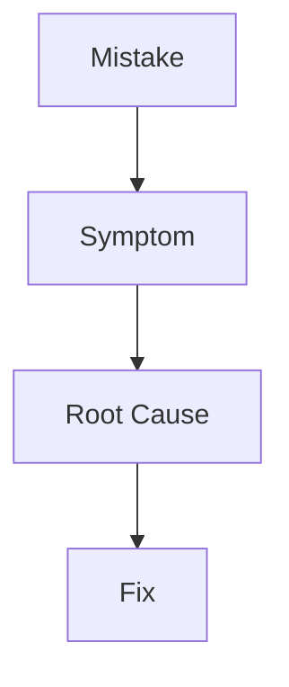

# 02 Common Mistakes

## What is it
A guide to common Docker mistakes beginners and teams make.

## Why do we need it
Mistakes in Docker files and commands lead to insecure, slow, and unstable apps.

## Real life analogy
Like packing for travel: if you pack the wrong things, your trip becomes stressful.

## How does it work
- See the mistake.
- Understand what goes wrong.
- Apply the fix with command or config.



## Mistakes and Fixes
1. Using latest tag everywhere.
   - Problem: unpredictable upgrades.
   - Fix: pin versions like nginx:1.27.0.
2. Running as root.
   - Problem: larger security blast radius.
   - Fix: add USER appuser.
3. Putting secrets in Dockerfile or env vars.
   - Problem: secrets leak via image history or inspect.
   - Fix: use secret manager.
4. Not using .dockerignore.
   - Problem: huge build context and leaked files.
   - Fix: ignore node_modules, .git, .env.
5. Installing dev dependencies in production.
   - Problem: bigger attack surface.
   - Fix: npm ci --omit=dev.
6. Wrong layer order.
   - Problem: slow builds every change.
   - Fix: copy package files first.
7. No resource limits.
   - Problem: noisy neighbor issues.
   - Fix: set --cpus and --memory.
8. Storing data inside container.
   - Problem: data loss after container removal.
   - Fix: use named volumes.

## Code or Command Example
### WRONG
```dockerfile
FROM node:18
COPY . .
RUN npm install
CMD ["npm", "start"]
```

### CORRECT
```dockerfile
FROM node:18.20.4-alpine3.20
WORKDIR /app
COPY package*.json ./
RUN npm ci --omit=dev
COPY . .
USER node
CMD ["node", "server.js"]
```

Expected output:
```text
Smaller image size, faster rebuilds, and improved security posture.
```

## Common Mistakes
- Assuming defaults are safe for production.
- Skipping logs and inspect when debugging.

## Best Practices
- Version-pin images.
- Keep images minimal.
- Externalize config and secrets.

## When to use it
Use this checklist before merging Docker changes.

## Related concepts
- [Dockerfile Best Practices](../03-dockerfile-deep-dive/05-dockerfile-best-practices.md)
- [Security Hardening](../09-docker-in-production/02-security-hardening.md)

## Quick Revision
- Common Docker Mistakes is easier when you think in small building blocks.
- We use specific versions and clear names to avoid surprises.
- We test commands step by step and read outputs carefully.
- We prefer safe defaults: least privilege, small images, persistent data paths.
- Practice this file commands once, then repeat without looking.

## Interview Questions
1. What is the main purpose of this concept?
   - It solves repeatability and clarity so teams can run the same app the same way.
2. What beginner mistake is most common in this concept?
   - Skipping basics like tags, names, and ports, then guessing when things fail.
3. How do you verify your setup works?
   - Run inspect and logs commands, then test with a real request.
4. When should you avoid this approach?
   - Avoid it when a simpler option already solves your problem.
