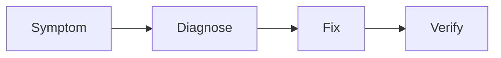

# 03 Troubleshooting Guide

## What is it
A practical map from symptom to cause to fix command.

## Why do we need it
Most Docker issues are simple once you check the right signals.

## Real life analogy
Like diagnosing a car: noise, dashboard warning, then targeted repair.

## How does it work
- Identify symptom.
- Check logs, inspect, and network.
- Apply fix and verify.



## Cases
1. Container exits immediately
   - Cause: main process ends.
   - Fix: run correct long-lived command.
   - Commands:
```bash
docker logs user-service
docker inspect user-service --format '{{.State.ExitCode}}'
```
2. Port already in use
   - Cause: host port occupied.
   - Fix: map different host port or stop conflicting process.
3. Permission denied
   - Cause: file owner mismatch or read-only fs.
   - Fix: run with correct user and file permissions.
4. Cannot connect to database
   - Cause: wrong hostname; should use service name.
   - Fix: use mongo-db or postgres-db in connection string.
5. Build fails at layer
   - Cause: missing file in context or invalid command.
   - Fix: inspect build context and Dockerfile path.
6. Volume not persisting
   - Cause: writing to wrong path.
   - Fix: verify mount target with docker inspect.
7. Out of disk space
   - Cause: unused images, containers, volumes.
   - Fix: docker system df then targeted prune.

## Code or Command Example
### WRONG
```bash
# Deleting everything without checking
docker system prune --all --volumes --force
```

### CORRECT
```bash
# Inspect disk use first
docker system df --verbose

# Remove only unused images
docker image prune --force

# Remove stopped containers
docker container prune --force
```

Expected output:
```text
Reclaimed space appears and active resources remain untouched.
```

## Common Mistakes
- Skipping logs.
- Guessing instead of inspecting.

## Best Practices
- Keep a runbook of repeated fixes.
- Add health checks to catch issues early.

## When to use it
Use during local debugging and production incident triage.

## Related concepts
- [Container Commands](../04-docker-commands/02-container-commands.md)
- [System Commands](../04-docker-commands/05-system-commands.md)

## Quick Revision
- Docker Troubleshooting is easier when you think in small building blocks.
- We use specific versions and clear names to avoid surprises.
- We test commands step by step and read outputs carefully.
- We prefer safe defaults: least privilege, small images, persistent data paths.
- Practice this file commands once, then repeat without looking.

## Interview Questions
1. What is the main purpose of this concept?
   - It solves repeatability and clarity so teams can run the same app the same way.
2. What beginner mistake is most common in this concept?
   - Skipping basics like tags, names, and ports, then guessing when things fail.
3. How do you verify your setup works?
   - Run inspect and logs commands, then test with a real request.
4. When should you avoid this approach?
   - Avoid it when a simpler option already solves your problem.
